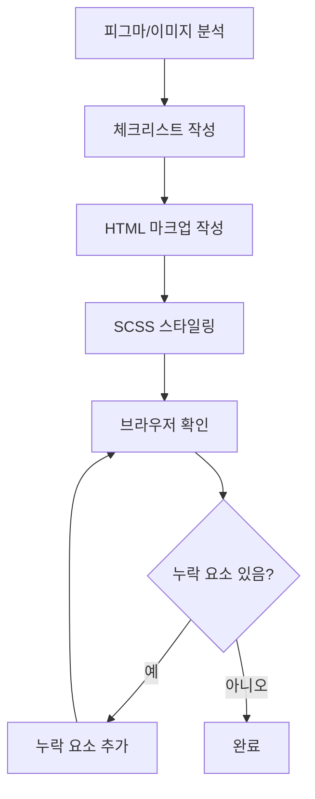

# 코드 완성도 검증 가이드

피그마 디자인이나 이미지를 기반으로 페이지를 구현할 때, **코드 누락을 방지**하기 위한 필수 체크리스트입니다.

## 🔴 핵심 원칙

> **"디자인의 모든 시각적 요소는 코드로 구현되어야 한다"**

피그마 디자인이나 참고 이미지에 보이는 **모든 UI 요소**를 빠짐없이 구현해야 합니다. 구현 전후에 반드시 이 체크리스트를 확인하십시오.

---

## 📋 구현 전 체크리스트

### 1. 디자인 분석 단계

#### 1.1 전체 레이아웃 파악

- [ ] 페이지 전체 구조 확인 (헤더, 본문, 푸터)
- [ ] 좌우 레이아웃 구조 (LNB, 콘텐츠 영역)
- [ ] 상단 네비게이션 영역 확인

#### 1.2 상단 영역 (Header Section)

- [ ] **페이지 타이틀** 존재 여부
- [ ] **즐겨찾기/북마크 버튼** 존재 여부
- [ ] **Breadcrumb 네비게이션** 존재 여부
  - 경로 텍스트 확인 (예: "조회/리포트 > 거래내역관리 > 원화입출금관리")
  - 화살표 아이콘 확인

#### 1.3 본문 영역 (Content Section)

- [ ] 제목/타이틀 영역
- [ ] 날짜/시간 정보
- [ ] 본문 콘텐츠 박스
- [ ] 테이블/리스트 (있는 경우)
- [ ] 폼 요소 (입력 필드, 셀렉트 박스 등)

#### 1.4 하단 영역 (Footer Section)

- [ ] 버튼 그룹 (목록, 저장, 취소 등)
- [ ] 페이지네이션
- [ ] 이전글/다음글 네비게이션

#### 1.5 기타 UI 요소

- [ ] 아이콘 (검색, 닫기, 화살표 등)
- [ ] 뱃지/태그
- [ ] 툴팁
- [ ] 모달/팝업

---

## 🔍 구현 후 검증 체크리스트

### 2. 코드 검증 단계

#### 2.1 HTML 마크업 검증

```markdown
- [ ] 페이지 타이틀 영역 (`<h1>`, `.view-title`)
- [ ] 즐겨찾기 버튼 (`.btn-toggle`, `.ico-bookmark`)
- [ ] Breadcrumb 네비게이션 (`.component-breadcrumb`)
- [ ] 본문 콘텐츠 영역
- [ ] 버튼 그룹 (`.component-btns`)
- [ ] 네비게이션 링크 (이전글/다음글)
```

#### 2.2 시각적 요소 검증

```markdown
- [ ] 모든 텍스트가 표시되는가?
- [ ] 모든 아이콘이 표시되는가?
- [ ] 모든 버튼이 표시되는가?
- [ ] 모든 링크가 표시되는가?
- [ ] 배경색/테두리가 적용되었는가?
```

#### 2.3 브라우저 검증 (필수)

```markdown
- [ ] 브라우저 도구로 실제 페이지 확인
- [ ] 스크린샷 캡처
- [ ] 원본 디자인과 비교
- [ ] 누락된 요소 확인
```

---

## 🎯 구현 프로세스

### 단계별 작업 흐름



### 1단계: 디자인 분석 및 체크리스트 작성

```
1. 피그마 URL 또는 이미지 확인
2. 화면을 위에서 아래로 스캔하며 모든 UI 요소 나열
3. 체크리스트 작성 (위의 "구현 전 체크리스트" 활용)
```

### 2단계: HTML 마크업 작성

```
1. 체크리스트의 각 항목을 HTML로 변환
2. 시맨틱 태그 사용 (<header>, <section>, <nav> 등)
3. 기존 컴포넌트 가이드 참조
```

### 3단계: SCSS 스타일링

```
1. 레이아웃 스타일 적용
2. 타이포그래피 적용
3. 색상 및 간격 적용
```

### 4단계: 브라우저 검증 (가장 중요!)

```
1. 브라우저 도구 사용하여 페이지 접속
2. 스크린샷 캡처
3. 원본 디자인과 나란히 비교
4. 누락된 요소 확인
5. 누락 요소 발견 시 즉시 추가
```

---

## ⚠️ 자주 누락되는 요소

### 상단 영역

- ❌ 페이지 타이틀 (`.view-title`)
- ❌ 즐겨찾기 버튼 (`.btn-toggle`)
- ❌ Breadcrumb 네비게이션 (`.component-breadcrumb`)

### 본문 영역

- ❌ 섹션 제목 (`<h2>`, `<h3>`)
- ❌ 날짜/시간 정보 (`<time>`)
- ❌ 아이콘 (`<i class="ico-*">`)

### 하단 영역

- ❌ 버튼 그룹 (`.component-btns`)
- ❌ 페이지네이션 (`.component-pagination`)
- ❌ 이전글/다음글 링크

---

## 📝 체크리스트 템플릿

구현 시작 전에 다음 템플릿을 사용하여 체크리스트를 작성하십시오:

```markdown
## [페이지명] 구현 체크리스트

### 상단 영역

- [ ] 페이지 타이틀: "**\_\_**"
- [ ] 즐겨찾기 버튼: 있음/없음
- [ ] Breadcrumb: "**\_** > **\_** > **\_**"

### 본문 영역

- [ ] 제목: "**\_\_**"
- [ ] 날짜: "**\_\_**"
- [ ] 콘텐츠 박스: 있음/없음
- [ ] 테이블: 있음/없음
- [ ] 기타: **\_\_**

### 하단 영역

- [ ] 버튼: [목록] [저장] [취소] 등
- [ ] 페이지네이션: 있음/없음
- [ ] 이전글/다음글: 있음/없음

### 브라우저 검증

- [ ] 스크린샷 캡처 완료
- [ ] 원본과 비교 완료
- [ ] 누락 요소 없음 확인
```

---

## 🔧 실전 예시

### 예시 1: 공지사항 상세 페이지

#### 디자인 분석 결과

```markdown
✅ 상단: "공지사항" 타이틀 + 즐겨찾기 버튼 + Breadcrumb
✅ 본문: 공지 제목 + 날짜 + 본문 박스
✅ 하단: 목록 버튼 + 이전글/다음글
```

#### 구현 코드

```html
<!-- 상단 영역 -->
<section class="view-header">
  <div class="view-title-box">
    <h2 class="view-title">공지사항</h2>
    <button type="button" class="btn btn-toggle">
      <i class="ico-bookmark" role="img" aria-label="즐겨찾기"></i>
    </button>
  </div>
  <nav class="component-breadcrumb" aria-label="Breadcrumb">
    <!-- Breadcrumb 내용 -->
  </nav>
</section>

<!-- 본문 영역 -->
<article class="notice-article">
  <header class="notice-header">
    <h3 class="notice-title">VANA 펌뱅킹 PM 작업</h3>
    <time class="notice-date" datetime="2026-01-04">2026.01.04</time>
  </header>
  <section class="notice-content">
    <!-- 본문 내용 -->
  </section>
</article>

<!-- 하단 영역 -->
<div class="component-btns">
  <button type="button" class="btn btn-outline-gray">
    <span class="btn-txt">목록</span>
  </button>
</div>
<nav class="notice-nav">
  <!-- 이전글/다음글 -->
</nav>
```

---

## 🚨 긴급 체크 포인트

구현 완료 후 **반드시** 다음을 확인하십시오:

1. **브라우저 도구로 실제 페이지 확인** ✅
2. **스크린샷 캡처 및 원본과 비교** ✅
3. **누락된 요소 없음 확인** ✅

> **"코드를 작성했다고 끝이 아니다. 브라우저에서 확인하고, 원본과 비교하여 완벽히 일치할 때까지 수정해야 한다."**

---

## 📚 참고 문서

- [HTML 가이드](./HTML.md)
- [CSS 가이드](./CSS.md)
- [UI 구조 가이드](./UI-Structure.md)
- [컴포넌트 가이드](./Component.md)
- [접근성 가이드](./Accessibility-Basic.md)
